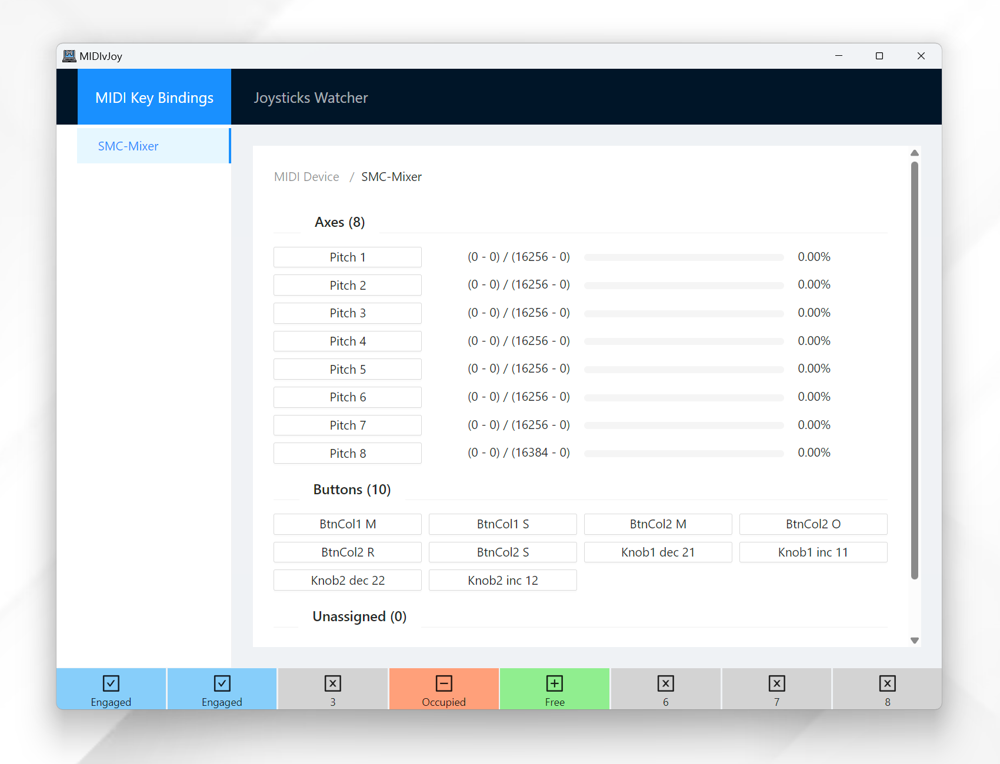
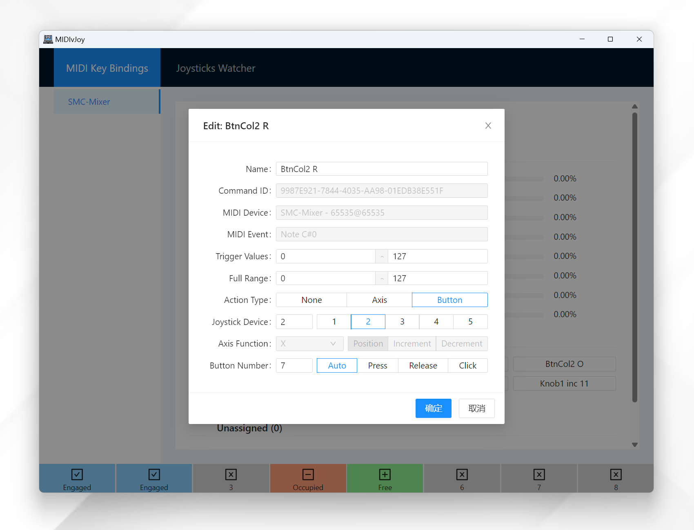
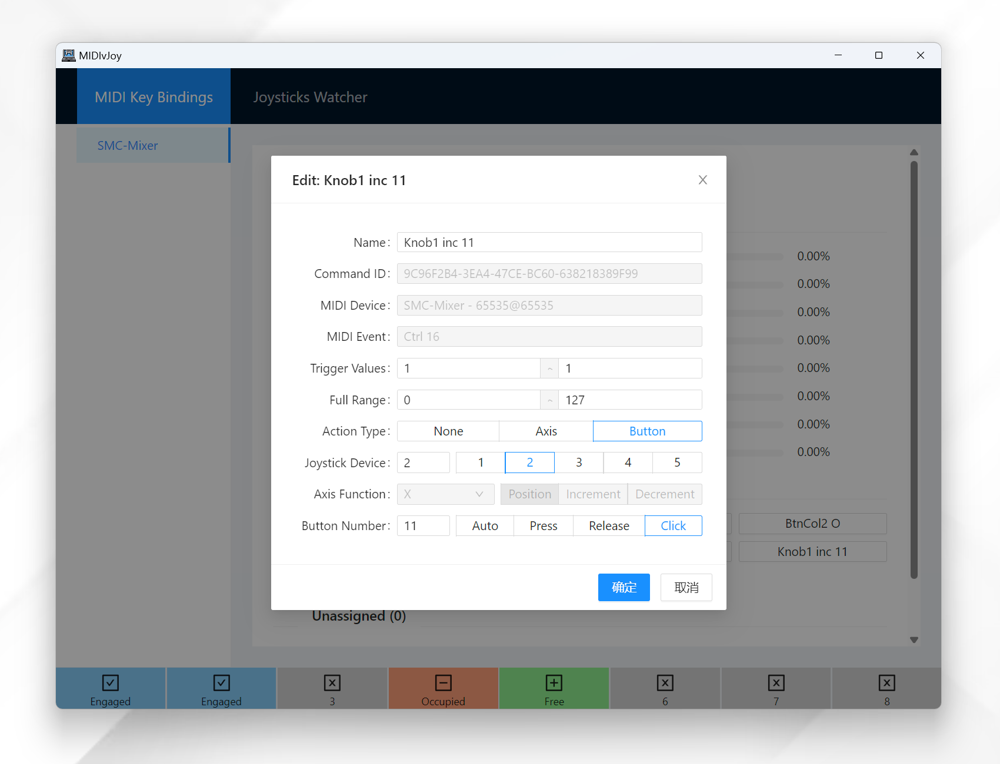
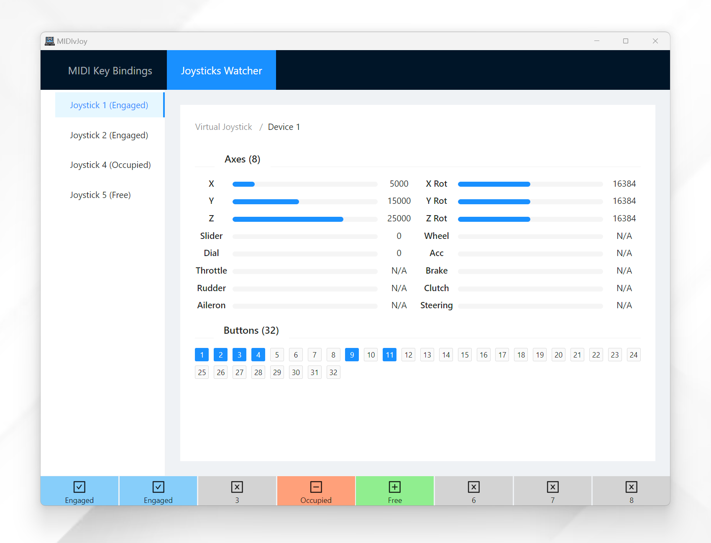

# MIDI Controllers to Joysticks

Simulate joystick inputs using MIDI controllers!

## Installation

1. Install vJoy [v2.1.9](https://sourceforge.net/projects/vjoystick/files/Beta%202.x/2.1.9.1-160719/) or [v2.2.1](https://github.com/njz3/vJoy/releases/tag/v2.2.1.1).
2. Download the [latest release](https://github.com/muhac/midi-controller-joysticks/releases/latest) of this project.
3. Extract the contents of the downloaded archive.
4. Run `MIDIvJoy.exe` to start the program.

## Usage

This program listens for MIDI controller inputs and maps them to vJoy joystick inputs. It will automatically detect any connected MIDI controllers and enabled vJoy devices.

Just move the fader/knob/button on your MIDI controller and the program will catch and list them in the `Unassigned` list. You can then map the detected MIDI event to a vJoy action by clicking on it and editing the properties in the popup window.

There are two basic types of joystick actions: `Axis` and `Button`. For the axis, you can change the range of the MIDI event by setting the minimum and maximum values. The action will be activated when the MIDI event value is within the *trigger range*, while the position of the joystick axis will be calculated based on the *full range*. You can tweak these ranges to get the desired sensitivity and dead zone.

For buttons, you can set the button number and whether the button is pressed or released. If you use the `Auto` option, the program will automatically set the value - released if the value is equal or smaller than the minimum value in *full range*, pressed if greater. However, for knobs, you need to set two actions when the knob is turned clockwise and counterclockwise. This kind of action can only be simulated as continuous button presses (possible but does not work well as axis increments).

After you have mapped all the MIDI events to vJoy actions, you should engage the vJoy by clicking the respective joystick button at the bottom of the window. The program will start sending the corresponding joystick actions to the vJoy device. You can disable the joystick by clicking the button again.

**Your configuration will be saved and loaded automatically, but you need to engage the joystick manually every time you start the program.**

There is a simple vJoy monitor that shows the current state of the vJoy devices. You can use this monitor to check if the joystick inputs are working as expected.

## Related Projects

- [Virtual Joystick](https://github.com/njz3/vJoy)
